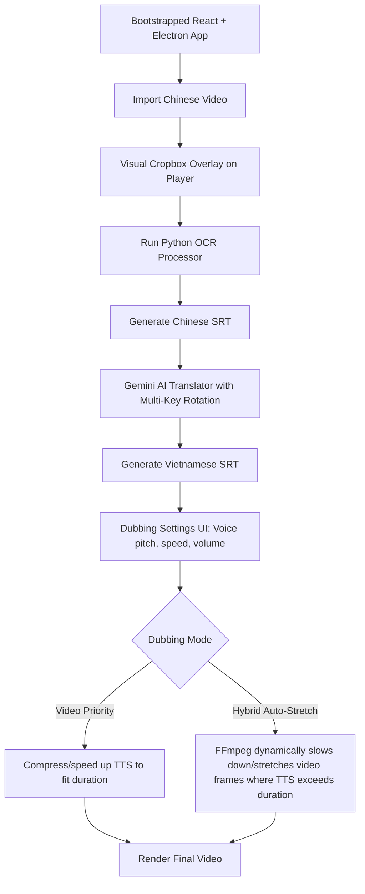

# Implementation Plan - Scratch-Built Video Subtitle OCR & AI Translation Tool

This plan details the step-by-step setup and development of a **completely new, scratch-built** Electron + React (Vite) desktop application inside `d:\vibeCodeAppDichTiengTrung` to handle video subtitle extraction (OCR), AI translation with key rotation, and hybrid text-to-speech dubbing.

---

## User Review Required

> [!IMPORTANT]
> **Bootstrapping a Fresh App**: We are building a brand new Electron + React + TypeScript app in `d:\vibeCodeAppDichTiengTrung`.
> We will initialize Vite first, then add Electron. This gives us full transparency, with no bloated template dependencies.
>
> **Python OCR Pipeline**:
> Since Python 3.14.3 is installed on your machine, we will run the OCR extraction through a clean Python child process.
> You will need to install the OCR and image processing libraries:
> `pip install opencv-python easyocr srt`

> [!TIP]
> **FFmpeg Binaries**: We will use Node's `ffmpeg-static` and `fluent-ffmpeg` to manage video segments and mixing directly inside the Electron backend, avoiding any external system dependencies for lồng tiếng.

---

## Architectural Workflow

---

## Detailed Step-by-Step Plan

### Phase 1: Bootstrapping the Project Structure

We will initialize a fresh Vite TypeScript project, configure Electron, and define the directory structure.

1. **Initialize Vite**:
   Run `npx create-vite@latest ./ --template react-ts --no-interactive --overwrite` to create the react-ts template in `d:\vibeCodeAppDichTiengTrung`.
2. **Install Core Dependencies**:
   - `npm install --save axios lucide-react framer-motion` (for icons, API calls, and smooth animations).
   - `npm install --save fluent-ffmpeg ffmpeg-static` (for lồng tiếng and rendering).
3. **Install Dev Dependencies**:
   - `npm install --save-dev electron concurrently typescript vite @types/node @types/react @types/react-dom`
4. **Configure Project Files**:
   - Create a clean `package.json` with scripts to run Electron in development (`npm run electron:dev`) and build.
   - Configure `tsconfig.json` for proper module resolution of both electron main process and React src code.
   - Create `electron/main.ts` and `electron/preload.ts` to bridge IPC between Vite and Electron.
   - Add styling support (e.g. clean vanilla CSS or tailwind config).

---

### Phase 2: Interactive Video Player & Visual Cropbox UI

A premium UI that handles video playing, subtitle rendering, and a visual dragging/resizing cropbox to target subtitles.

1. **Interactive SubtitleCropbox**:
   - Overlay a canvas/SVG box over the HTML5 `<video>` player.
   - Enable the user to drag the cropbox and resize its boundaries to fit perfectly around the subtitles.
   - Real-time resolution conversion: Convert the DOM-scaled cropbox coordinates (`x`, `y`, `width`, `height`) into normalized ratios (`x_min`, `y_min`, `x_max`, `y_max` from `0.0` to `1.0`) based on the video's actual metadata.
2. **Video & Subtitle Import Panels**:
   - Simple drag-and-drop or select button using Electron Dialog.
   - Real-time metadata loading (duration, resolution, format) using `ffprobe`.

---

### Phase 3: Python OCR Subtitle Extractor

Integrate a Python script for character recognition on the cropped frames.

1. **`python_services/ocr_processor.py`**:
   - Opens the video with `cv2.VideoCapture`.
   - Iterates through frames at a target sampling rate (e.g., 5 frames per second) to optimize speed.
   - Crops each frame to pixel coordinates calculated from the normalized coordinates:
     `x1 = int(x_min * width)`, `y1 = int(y_min * height)`, etc.
   - Runs `easyocr.Reader(['ch_sim', 'en'])` to perform high-accuracy Chinese character recognition on the cropped image blocks.
   - Clusters text timelines: if consecutive frames have the same text, group them and set `start_time` and `end_time`.
   - Cleans noise and exports the result directly to a standard UTF-8 `.srt` file.
   - Prints formatted JSON to `stdout` (`{"progress": 25, "status": "OCR on frame 250..."}`) for real-time IPC tracking.
2. **IPC Handler in Electron**:
   - Child process spawner that monitors script execution, parses `stdout` for progress, and pushes updates to Vite via WebContents event emitters.

---

### Phase 4: Gemini SRT AI Translation with API Key Rotation

A highly robust, multi-key translation engine to completely bypass rate limit restrictions.

1. **Multiple API Key Input Manager**:
   - Dedicated textarea / key manager in the UI where the user can paste multiple Gemini API keys (line-by-line).
2. **`GeminiTranslator` Service (Electron)**:
   - Processes SRT translation in groups of 10-15 lines (keeps context while speeding up API calls).
   - Core API key rotation logic:
     - Maintains a pointer to the active key.
     - On a translation chunk request: makes an Axios HTTP call to Gemini API using the active key.
     - If Gemini responds with a `429 Too Many Requests` (rate limit) or quota exceeded error, the service catches the error, increments the pointer to the next key, logs: `"[System] Key #1 rate limited. Switched to Key #2!"` to the UI, and automatically retries the translation batch with the new key!
     - Preserves the perfect SRT line numbering and timestamp structure.

---

### Phase 5: Voice Lồng Tiếng Engine & Hybrid Synchronization (Auto-Stretch)

Integrate the premium lồng tiếng settings popup and advanced FFmpeg auto-stretching.

1. **Dubbing Configurators**:
   - Match your CapCut screenshot with controls for:
     - **Giọng Đọc 1 (Mặc định)**, **Giọng Đọc 2**, **Giọng Đọc 3** setup panels.
     - Server selection (CapCut TTS, Google Cloud, OpenAI, ElevenLabs).
     - Sliders for Speed (`0.5x` to `2.0x`), Volume (`0%` to `200%`), Pitch (`-20` to `20`).
2. **TTS Dubbing Modes**:
   - **Video Priority (Chế độ 1: Giữ nguyên thời lượng gốc)**:
     - Compares TTS duration with the original subtitle segment duration.
     - If the generated TTS is longer, use FFmpeg's `atempo` audio filter to speed up the audio clip to fit the slot.
   - **Hybrid Auto-Stretch (Chế độ 2: Hybrid - Tự động giãn video)**:
     - When a TTS clip duration is longer than the subtitle duration, instead of rushing the voice, **we stretch the video**!
     - In FFmpeg, we split the video into segments based on the subtitle timestamps.
     - For the segment where TTS exceeds video, we apply the video filter `setpts=PTS*factor` where `factor = tts_duration / original_duration` (making it slower/stretching the clip).
     - We then merge the video segments back together and overlay the TTS audio clips at their respective stretched timestamps!
     - This creates a perfect lồng tiếng effect where the video pauses/slows down naturally when a long sentence is spoken.

---

## Verification Plan

### Automated Tests
- Bootstrapping verification: Ensure Vite builds successfully and Electron launches with Node API access.
- Python OCR Test: Verify python script crop coordinates and EasyOCR extraction on a 10-second sample video.
- Gemini Rotation Test: Run mock translations using a rate-limited key and active key, checking if the service retries and succeeds.

### Manual Verification
1. Open the application, import a Chinese video, and verify it plays.
2. Select subtitle region visually, run OCR, and review generated Chinese SRT.
3. Paste multiple Gemini API keys, run translation, and verify Vietnamese output.
4. Select TTS lồng tiếng options, choose **Chế độ 2: Hybrid**, render, and review the stretched video outputs.
